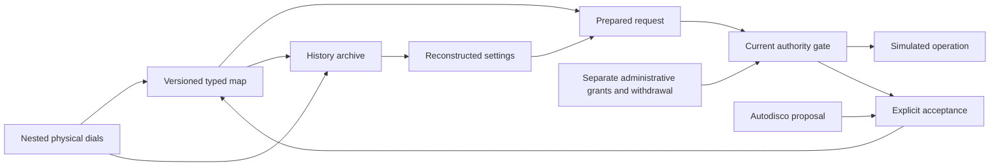

# ELEVEN-HEAP-001 — The Infinite Radio Console

A runnable reference experiment for the Static Collective's reusable dial grammar.
One simulated receiver uses the same nested dial engine with interchangeable typed
maps for frequency selection, attention selection, and transmission requests.

This workspace arrived without a reLATTE or Autodisco implementation. The experiment
therefore models the requested semantics independently. Autodisco is represented by
a deterministic energy-window proposer; this is not a claim about an existing system.

Python 3.12+, standard library only. Run from this directory:

```bash
python3 experiment.py
python3 -m unittest discover -s tests -v
```

The checked-in evidence is in [artifacts/RESULTS.md](artifacts/RESULTS.md), with
the complete [experiment output](artifacts/experiment.json) and portable
[history archive](artifacts/history.json). The runner uses explicit failures,
so running Python with optimization does not disable its experiment checks.

## What the experiment does

1. Tunes the synthetic beacon at exact address `11:[7,3,10,2,8,4]`.
2. Records the address, rational frequency, source samples, and complete source lineage.
3. Reconstructs that captured instrument on another simulated machine with no imported authority.
4. Changes the frequency map to an attention map while preserving every physical control setting.
5. Lets Autodisco propose the strongest three-sample listening region, `[13,16)`.
6. Explicitly accepts the proposal, producing a new attention-map version without moving a dial.
7. Withdraws the attention affordance; both an existing prepared request and a fresh request fail.
8. Separately regrants the affordance and verifies that the old request remains stale.
9. Turns the response selector and recursively nested sensitivity dials. Authority remains unchanged.
10. Prepares a transmission request, exercises the independent permission gates, and allows a
    simulated transmission only when both grants are valid and applicable.
11. Revokes transmission permission and verifies that the previously prepared request fails.
12. Hands off the complete instrument state and verifies exact reconstruction again.

The beacon frequency is deliberately constructed from the target address. This
checks semantics and reproducibility with a known fixture; it is not an RF measurement.

## The dial grammar

An address is a nonempty sequence of eleven-way choices, using digits **0 through 10**.
Each digit selects one eleventh of its parent's interval. For a depth `d` path with
base-eleven index `n`, its exact normalized cell is `[n/11^d, (n+1)/11^d)` and its
selection coordinate is the midpoint. Fractions are serialized as integer ratios.

Six choices distinguish **1,771,561 cells**. Additional depth is limited by machine
resources rather than an imposed precision ceiling. The tests include a depth-100
address whose neighboring states collapse to the same floating-point number but
remain distinct in this model.

The coordinate is an input to an explicitly typed map. It is not a shared physical
quantity:

| Map | Selection type | Meaning and resolution |
| --- | --- | --- |
| Frequency | `FrequencySelection` | Exact Hz and the enclosing frequency cell |
| Attention | `AttentionSelection` | A source ID and a half-open source sample interval |
| Transmit | `TransmissionRequest` | Requested Hz, watts, and modulation mode |
| Response selector | Response policy | Linear, logarithmic, thresholded, or context-sensitive motion |
| Sensitivity | Motion gain | A dimensionless multiplier governing another dial's motion |

Attention addresses can resolve to the same sample when the source has fewer samples
than the grammar has cells. The address still distinguishes the control states;
the instrument's own resolution limits its distinguishable outputs.

Three physical controls are sufficient: the primary selector, the sensitivity selector,
and the response selector. Entering a child region is an explicit zoom action.
Turning the primary control moves the current finest address digit, with carry and
end stops. Center-child zoom preserves the selected coordinate and makes the next
tick eleven times finer.

A sensitivity dial can itself contain a sensitivity dial, recursively. A sensitivity
node's normalized setting `u` gives gain `1/(1 + 10u)`; nested gains multiply. Each
node may use its own response policy. `turn_sensitivity(ticks, depth=...)` operates
the selected nested node, without moving the primary address.

The response selector's eleven positions map to four policies: `0..2` linear,
`3..5` logarithmic, `6..8` thresholded, and `9..10` context-sensitive.

| Response | Movement meaning |
| --- | --- |
| Linear | One input tick produces one address-step before sensitivity scaling |
| Logarithmic | Version-1 fixed-point table approximating `10 log10(1 + 9|ticks|/10)`; signed symmetrically |
| Thresholded | Gestures below the recorded threshold produce zero movement |
| Context-sensitive | Tick movement is divided by `1 + context_load` |

Fractional pending movement is retained exactly. A smaller gain accumulates several
gestures before advancing an address cell. Zoom clears that remainder, and end stops
discard pending outward motion. The full remainder, context, curve, threshold,
response selector, and recursive sensitivity tree survive reconstruction.

## Current authority and historic settings



The grammar has no grant operation. Dial movements, zoom, map changes, proposals,
preparation, and history reconstruction cannot change the gate's authority state.

A prepared request is bound to its console, current control revision, map digest,
source digest, exact selection, and authority epoch. Execution rechecks all of these.
Withdrawal and regrant each advance the authority epoch, so old requests do not
become valid again. Successful requests are consumed once. Changed maps, changed
sources, and changed dials require fresh preparation.

Transmission additionally requires both a separate unexpired transmission permission
and an unexpired radio authorization covering the operator, device, jurisdiction,
frequency, power, and mode. Neither alone is sufficient. Time is an explicit
simulation input, and expiry is checked at execution, including the exact deadline.
All successful transmission receipts say `rf_emitted: false`; no RF adapter is present.

The authority gate is a trusted in-process simulation fixture. These tests establish
model behavior, not a hardened boundary against arbitrary Python code that can alter
the process. A real hardware implementation must put enforcement at the transmission
boundary, use authenticated current grants and trusted time, and retain these checks.

## Replay and handoff

The archive holds every captured state and a SHA-256 chain of events. Replay
reconstructs captured state; it never re-executes prior operations or imports grants,
prepared requests, or proposals. Each event captures the map definition and source
lineage, so a historic frequency setting does not silently acquire attention semantics.

```python
import json
from pathlib import Path
from infinite_radio import AuthorityGate, replay

archive = json.loads(Path("artifacts/history.json").read_text())
current_gate = AuthorityGate()  # No affordances or transmission grants.
instrument = replay(archive, current_gate)
print(instrument.dial.address.to_dict())
print(instrument.control_map.interpret(instrument.dial.address))
```

To reconstruct an earlier captured state, provide the archive prefix ending at that
event. History is copied on export, so modifying an exported object does not modify
the live console's historic records.

The hash chain detects accidental edits, middle-event omission, and reordering.
It is not a signature: a malicious party can recompute an entire chain, and removal
of a suffix requires a separately trusted head digest to detect. Replay therefore
treats the archive as setting data, never as an authorization source.

## Using the controls directly

```python
from fractions import Fraction
from experiment import fixture
from infinite_radio import Address, ControlMap, Dial

gate, console = fixture()
console.zoom()                         # Enter the center child region.
console.turn(2)                        # Two ticks at the current zoom depth.
console.set_sensitivity(Dial(Address((5,)), sensitivity=Dial(Address((4,)))))
console.turn_sensitivity(1, depth=2)    # A dial governing another sensitivity dial.
console.turn_response(3)               # Select logarithmic movement.
console.set_response("context-sensitive", context_load=Fraction(3, 2))

source = next(iter(console.signals.values()))
console.switch_map(ControlMap("attention", 1, "attention",
                              signal_id=source.id, sample_region=(0, len(source.samples))))
proposal = console.autodisco()
console.accept(proposal, now=100)
prepared = console.prepare()
gate.withdraw("attend")                # Separate administrative action; controls stay put.
# console.execute(prepared, now=100) raises Denied.
```

This experiment supports carrying one control grammar across typed instruments
while preserving provenance and refusing stale authority. Integration with the actual
reLATTE, Autodisco, and Static Collective systems remains separate work once their
interfaces are available.
